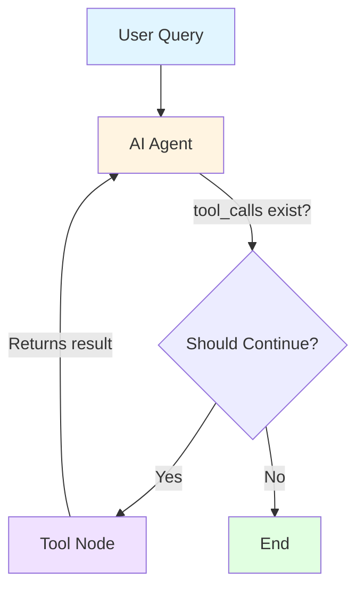

# ReAct Agent - Technical Deep Dive

## Table of Contents
1. [Understanding the Messages State](#understanding-the-messages-state)
2. [How Streaming Works](#how-streaming-works)
3. [Step-by-Step Execution Example](#step-by-step-execution-example)

---

## Understanding the Messages State

### Type Annotation Explained

```python
messages: Annotated[Sequence[BaseMessage], add_messages]
```

**What does this mean?**

> "messages is a list of BaseMessage objects, and whenever new messages are produced, combine them with the old ones using the `add_messages` reducer."

### Breaking It Down

- **`Sequence[BaseMessage]`**: The messages field is a sequence (list) of message objects
- **`Annotated[..., add_messages]`**: The `add_messages` function tells LangGraph how to merge new messages into the existing list
- **Result**: Instead of replacing the entire list, new messages are **appended** to the existing conversation history

### Why This Matters

Without the reducer, each node would overwrite the entire message list. With `add_messages`, the conversation history accumulates naturally:

```python
# Without reducer (BAD):
state["messages"] = [new_message]  # Overwrites everything!

# With add_messages reducer (GOOD):
state["messages"] = old_messages + [new_message]  # Appends!
```

---

## How Streaming Works

### What is `app.stream()`?

```python
app.stream(inputs, stream_mode="values")
```

When you call this, you're executing the graph, but instead of getting one final result at the end, you get a **Python generator** that yields **partial states** as the agent processes them.

### Understanding `s["messages"][-1]`

Each streamed item `s` is a dictionary representing the agent's current state. It always contains a key `"messages"` holding the conversation so far.

```python
message = s["messages"][-1]
```

This extracts the **latest message** (the one just produced), which could be:

- A tuple like `("user", "Add 30 + 12...")`
- A LangChain message object like `AIMessage(...)` or `ToolMessage(...)`

### Why Use Streaming?

✅ **Real-time feedback**: See the agent's thought process as it happens  
✅ **Better UX**: Show progress instead of waiting for the final result  
✅ **Debugging**: Understand exactly what the agent is doing at each step  

---

## Step-by-Step Execution Example

Let's trace through the exact execution of this query:

> "Add 30 + 12, then multiply the result by 6. Also tell me a joke."

---

### 📍 **Step 0 — Initial Input**

**User types:**
```
Add 30 + 12, then multiply the result by 6. Also tell me a joke.
```

**Snapshot 0 (`s`):**
```python
{
  "messages": [
    ("user", "Add 30 + 12, then multiply the result by 6. Also tell me a joke.")
  ]
}
```

**`s["messages"][-1]`:**
```python
("user", "Add 30 + 12, then multiply the result by 6. Also tell me a joke.")
```

---

### 🤖 **Step 1 — AI Decides to Call `add` Tool**

**Snapshot 1 (`s`):**
```python
{
  "messages": [
    ("user", "Add 30 + 12, then multiply the result by 6. Also tell me a joke."),
    AIMessage(
      content="I will add 30 + 12.",
      tool_calls=[{
        "tool": "add",
        "args": {"a": 30, "b": 12},
        "call_id": "call_fhUu9eLzcVVsugoRDJwhmqsN"
      }]
    )
  ]
}
```

**`s["messages"][-1]`:**
```python
AIMessage(content="I will add 30 + 12.", tool_calls=[...])
```

**Printed via `.pretty_print()`:**
```
================================== Ai Message ==================================
Tool Calls:
  add (call_fhUu9eLzcVVsugoRDJwhmqsN)
 Call ID: call_fhUu9eLzcVVsugoRDJwhmqsN
  Args:
    a: 30
    b: 12
```

---

### 🔧 **Step 2 — Tool Executes `add(30, 12)`**

**Snapshot 2 (`s`):**
```python
{
  "messages": [
    ("user", "..."),
    AIMessage(content="I will add 30 + 12.", tool_calls=[...]),
    ToolMessage(
      name="add",
      content="42",
      tool_call_id="call_fhUu9eLzcVVsugoRDJwhmqsN"
    )
  ]
}
```

**`s["messages"][-1]`:**
```python
ToolMessage(name="add", content="42", tool_call_id="...")
```

**Printed via `.pretty_print()`:**
```
================================= Tool Message =================================
Name: add

42
```

---

### 🤖 **Step 3 — AI Decides to Call `multiply` Tool**

**Snapshot 3 (`s`):**
```python
{
  "messages": [
    ("user", "..."),
    AIMessage(content="I will add 30 + 12.", tool_calls=[...]),
    ToolMessage(content="42"),
    AIMessage(
      content="Now I'll multiply 42 by 6.",
      tool_calls=[{
        "tool": "multiply",
        "args": {"a": 42, "b": 6},
        "call_id": "call_Lz6FtkduK9jAiVsKM8tZdBUn"
      }]
    )
  ]
}
```

**`s["messages"][-1]`:**
```python
AIMessage(content="Now I'll multiply 42 by 6.", tool_calls=[...])
```

**Printed via `.pretty_print()`:**
```
================================== Ai Message ==================================
Tool Calls:
  multiply (call_Lz6FtkduK9jAiVsKM8tZdBUn)
 Call ID: call_Lz6FtkduK9jAiVsKM8tZdBUn
  Args:
    a: 42
    b: 6
```

---

### 🔧 **Step 4 — Tool Executes `multiply(42, 6)`**

**Snapshot 4 (`s`):**
```python
{
  "messages": [
    ("user", "..."),
    AIMessage(content="I will add 30 + 12.", tool_calls=[...]),
    ToolMessage(content="42"),
    AIMessage(content="Now I'll multiply 42 by 6.", tool_calls=[...]),
    ToolMessage(
      name="multiply",
      content="252",
      tool_call_id="call_Lz6FtkduK9jAiVsKM8tZdBUn"
    )
  ]
}
```

**`s["messages"][-1]`:**
```python
ToolMessage(name="multiply", content="252", tool_call_id="...")
```

**Printed via `.pretty_print()`:**
```
================================= Tool Message =================================
Name: multiply

252
```

---

### 🎉 **Step 5 — Final AI Response (Answer + Joke)**

**Snapshot 5 (`s`):**
```python
{
  "messages": [
    ("user", "..."),
    AIMessage(content="I will add 30 + 12.", tool_calls=[...]),
    ToolMessage(content="42"),
    AIMessage(content="Now I'll multiply 42 by 6.", tool_calls=[...]),
    ToolMessage(content="252"),
    AIMessage(
      content="""The result of adding 30 and 12, and then multiplying 
      the total by 6 is 252.
      
      Here's a joke for you: Why don't scientists trust atoms?
      Because they make up everything!"""
    )
  ]
}
```

**`s["messages"][-1]`:**
```python
AIMessage(content="The result of adding 30 and 12...")
```

**Printed via `.pretty_print()`:**
```
================================== Ai Message ==================================

The result of adding 30 and 12, and then multiplying the total by 6 is 252.

Here's a joke for you: Why don't scientists trust atoms?
Because they make up everything!
```

---

## Key Takeaways

### 🔄 The ReAct Loop

1. **Think**: AI decides what to do (which tool to call)
2. **Act**: Tool executes and returns a result
3. **Observe**: AI sees the tool's output
4. **Repeat**: Loop continues until the task is complete

### 📊 Message Flow

```
User Input → AI (plans) → Tool (executes) → AI (observes) → Tool (executes) → AI (final answer)
```

### 💡 Why This Architecture is Powerful

- **Multi-step reasoning**: AI can chain multiple tools together
- **Observable behavior**: Every step is visible in the message history
- **Flexible execution**: AI decides dynamically which tools to use and when
- **Error recovery**: AI can see tool failures and try alternative approaches

---

## Visualization



This creates a **feedback loop** where the AI can use tools iteratively until it has all the information needed to answer the user's question.
